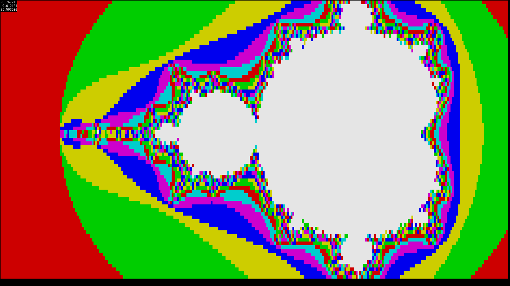
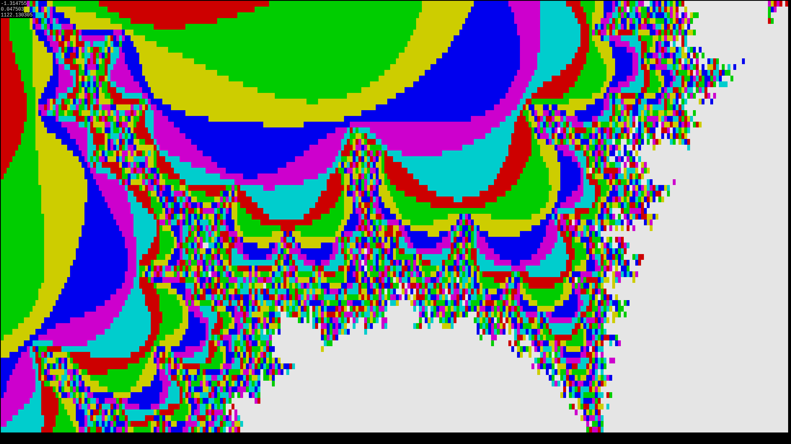
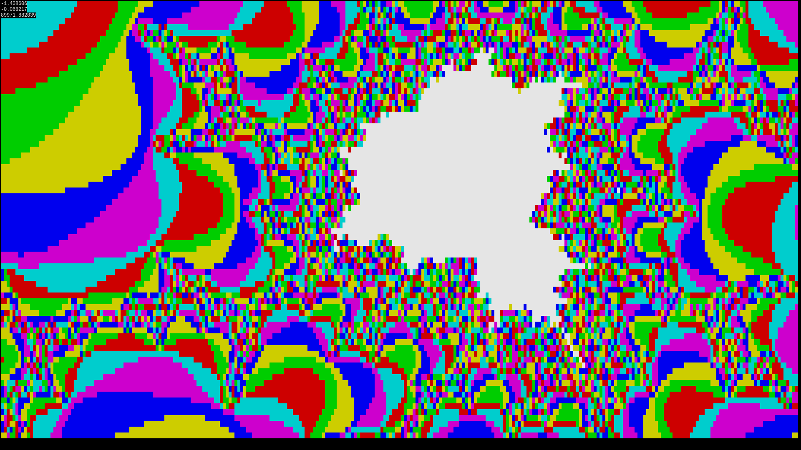
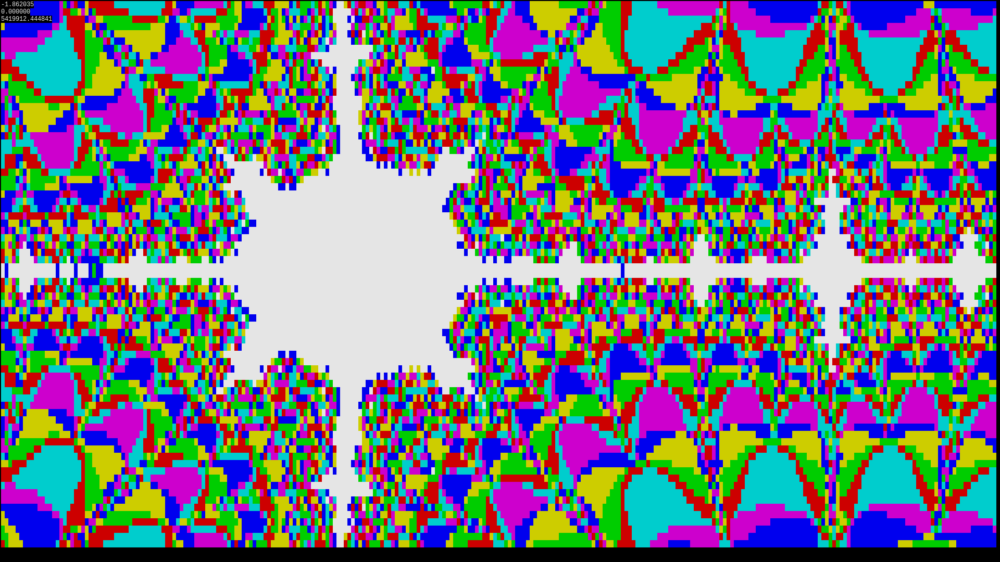
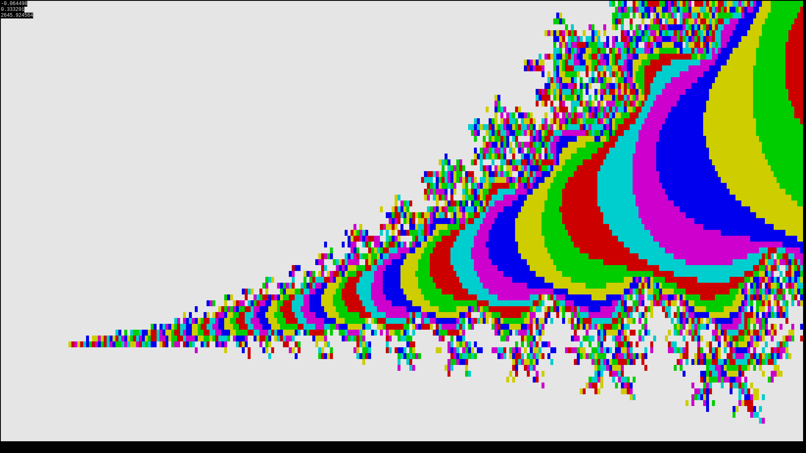

# Terminal Mandelbrot

Mandelbrot set visualisation for terminal.

## Compilation and Usage

### Compilation
```gcc src/mandelbrot.c -o mandelbrot```

### Usage
Run with ```./mandelbrot.sh```
Move around using `wsad`, use `qe` to zoom in and out, use 'j' to switch between Mandelbrot and Julia Set. Press any other key to exit.

## Screenshots

***

***

***

***

