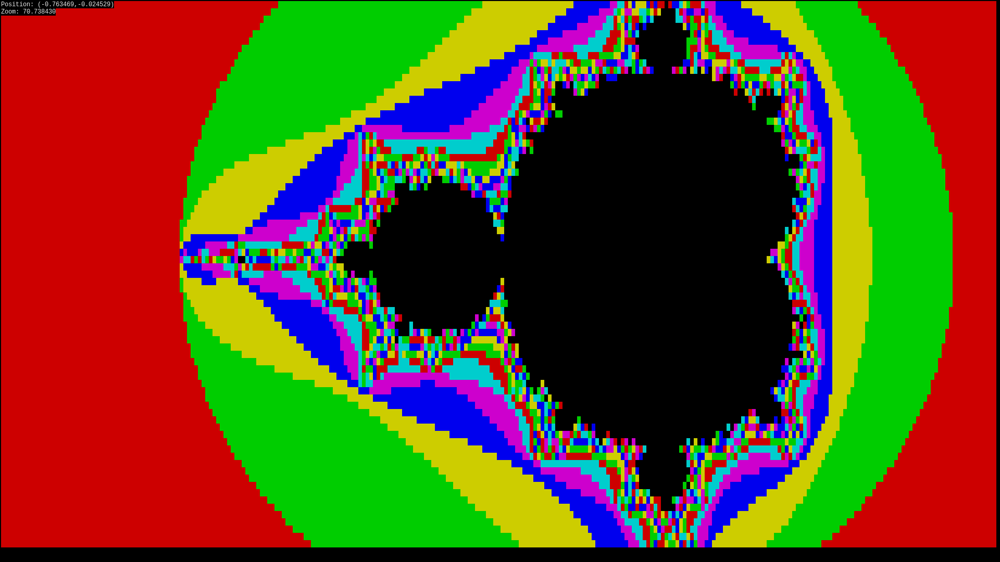
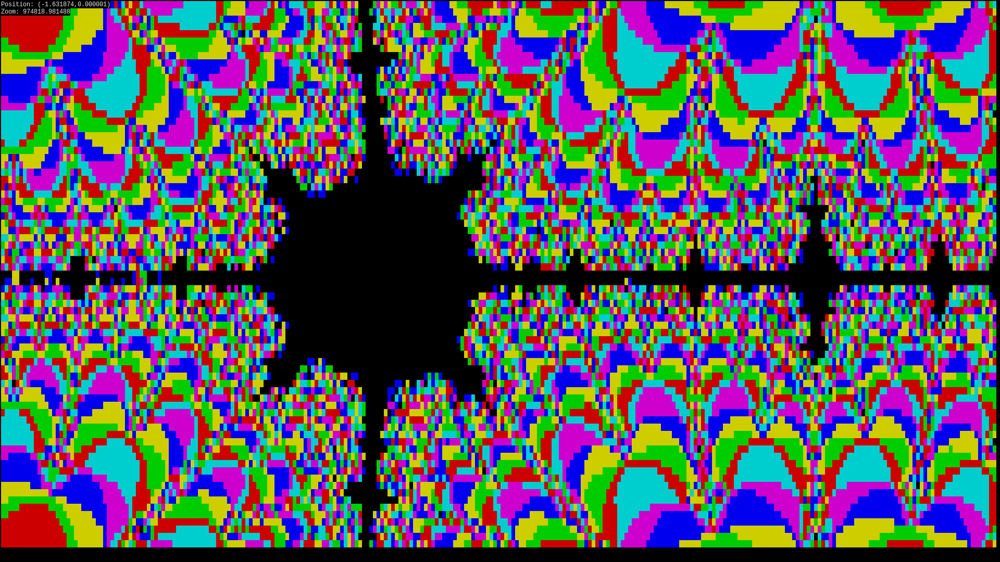
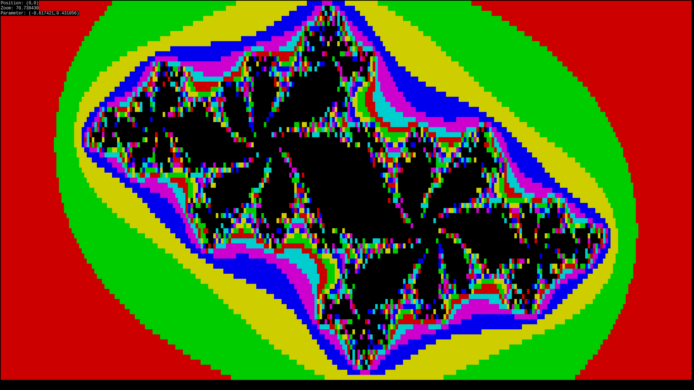
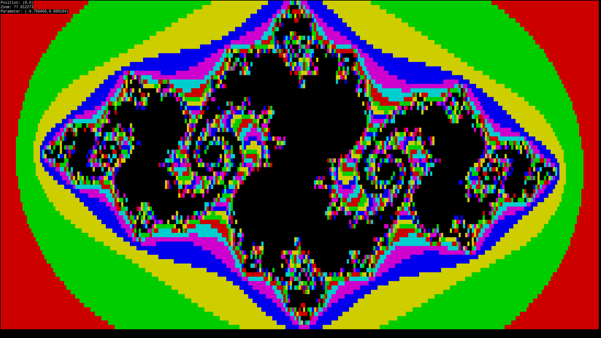

# Terminal Mandelbrot

Mandelbrot set visualisation for terminal.

## Installation
Use `make` to compile, run with `./mandelbrot` (from the same directory).

Or `sudo make install` and run with `mandelbrot` from anywhere!

## Usage
Move around using `wsad`, use `qe` to zoom in and out, use `j` to switch between Mandelbrot and Julia Set. Press any other key to exit.

## Screenshots

### Mandelbrot Set

### Julia Sets

