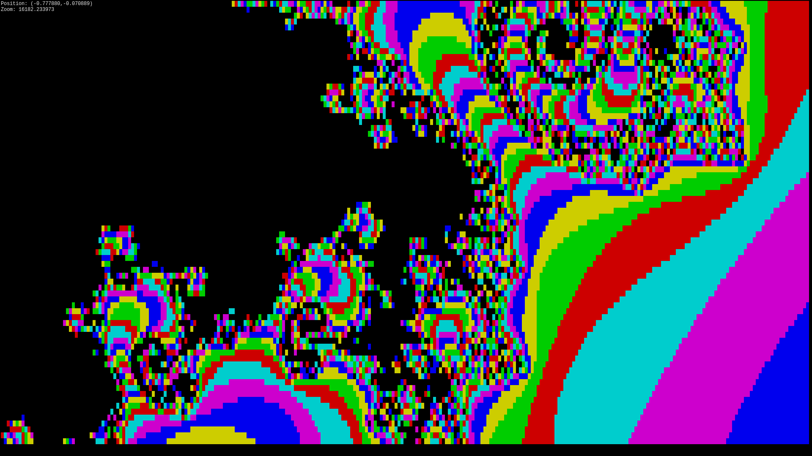

# Terminal Mandelbrot

Mandelbrot set visualisation for terminal.

## Installation
Use `make` to compile, run with `./mandelbrot` (from the same directory).

Or `sudo make install` and run with `mandelbrot` from anywhere!

## Usage
Move around using `wsad`, use `qe` to zoom in and out.
Press any of the unused keys to exit.

### Mandelbrot Mode
This is the default mode.
Use `f` to switch to Julia mode (your location is used as the complex parameter).

### Julia Mode
In addition to Mandelbrot navigation, `ikjl` change the complex parameter.
Use `f` to switch to Mandelbrot mode.

## Screenshots

### Mandelbrot Set

### Julia Sets

